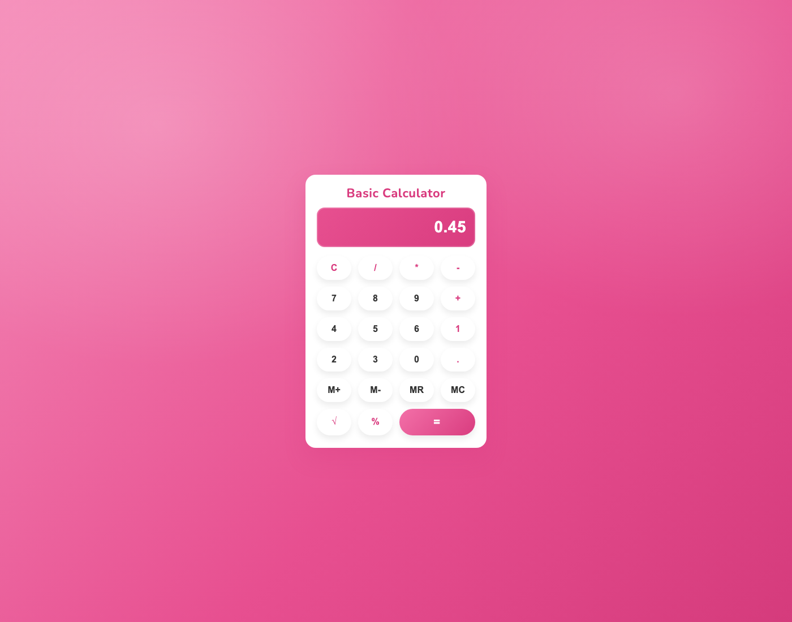

# 🧮 Basic Calculator – Full Stack Version

## 📌 Project Overview
This project is a **full-stack Basic Calculator application** built using **HTML, CSS, JavaScript (Frontend)** and **Node.js with Express (Backend)**.

Unlike a simple frontend-only calculator, this project uses a **backend API** to handle:
- Arithmetic calculations
- Memory operations (M+, M-, MR, MC)
- Advanced operations like Square Root (√) and Percentage (%)

This project is developed as part of the **Unified Mentor Assignment** to demonstrate frontend–backend integration, error handling, and professional project structure.
The frontend UI now includes a **dribbble-inspired pink theme** with a centered **"Basic Calculator"** title, rounded display, and circular button styling.

---

## 🚀 Features

### 🔹 Basic Operations
- Addition (+)
- Subtraction (-)
- Multiplication (*)
- Division (/)

### 🔹 Advanced Operations
- Square Root (√)
- Percentage (%)

### 🔹 Memory Functions (Backend Controlled)
- **M+** → Add value to memory  
- **M-** → Subtract value from memory  
- **MR** → Recall memory value  
- **MC** → Clear memory  

> Memory is stored **on the server during runtime** and resets when the server restarts.

---

## 📸 Feature Screenshots

### Home Screen


### Basic Calculation (7 + 8 = 15)


### Square Root (√81 = 9)


### Percentage (45% = 0.45)


### Memory Add + Recall (M+ then MR)


### Memory Subtract (M- then MR)


### Memory Clear (MC then MR = 0)


---

## ⌨️ Keyboard Shortcuts
| Key | Action |
|----|-------|
| 0–9 | Number input |
| + - * / | Operators |
| Enter | Equals (=) |
| Backspace | Delete |
| C | Clear |
| Ctrl + M | Memory Add (M+) |
| Ctrl + N | Memory Subtract (M-) |
| Ctrl + R | Memory Recall (MR) |
| Ctrl + C | Memory Clear (MC) |

---

## 🖥️ Tech Stack

### Frontend
- HTML5
- CSS3
- Vanilla JavaScript

### Backend
- Node.js
- Express.js
- REST APIs

---

## 📂 Project Structure

Basic-Calculator/
│
├── client/
│ ├── index.html
│ ├── style.css
│ └── script.js
│
├── server/
│ ├── server.js
│ └── package.json
│
└── README.md

---

## ⚙️ How to Run the Project

### 1️⃣ Clone the Repository
```bash
git clone <your-github-repo-link>
cd Basic-Calculator
```

### 2️⃣ Start Backend Server
```bash
cd server
npm install
node server.js
```
Server runs on:

http://localhost:5001

### 3️⃣ Open Frontend

Open client/index.html in your browser.
